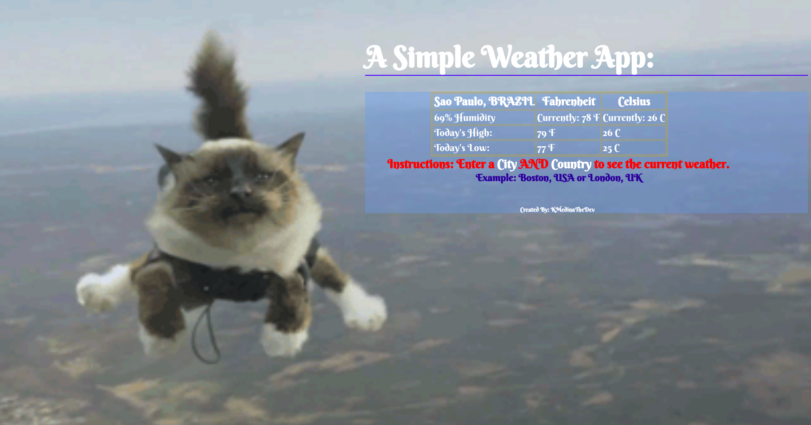

## My Weather App, using Open Weather Map's API!

I developed a weather App!
1. Use the prompts to enter the City and Country.
2. The weather for the location searched will populate in a table I have created in HTML.
3. You'll receive the current temperature along with the Highs and Lows for the Today, in both Fahrenheit and Celsius.
4. As an added bonus you'll also be informed on the humidity level.

## How It's Made

1. JavaScript, jQuery
2. HTML
3. CSS
4. Open Weather Map API key required

In order to use this weather app please be sure to sign up for openweathermap.org and generate your own API. This API allows you to make 1000 request per day. Once you have your personal API key simply plop it into the apiKey variable provided in the main.js file and you're good to go.

I Perform an asynchronous HTTP (Ajax) request to pull the current weather data for the city and country searched. In another app I use coordinates instead of the city and country to pull similar data.

I chose to display the data pulled in a table for readability.

##Optimizations

Initially my app pulled the weather in Kelvin, as this is the format in which it is stored. I added a function to convert from kelvin to Fahrenheit and since most countries actually use Celsius I later decided to feature the temperature reading using both of these. Keeping both conversions inside of one function along with manipulating the DOM allowed me to call this function only once and populate the data into the table simultaneously.

Since I'm currently in Boston and the temperature can dip quite quickly I thought it important to include High and Lows for the day. This also allowed me to practice targeting specific data from the object and displaying it.

Humidity levels are extremely influential, this bonus feature can be quite useful, especially for anyone wondering what kind of hair day it may be.

## Improvements to Be Made:

With more time I would make this app fully responsive to for all devices.
